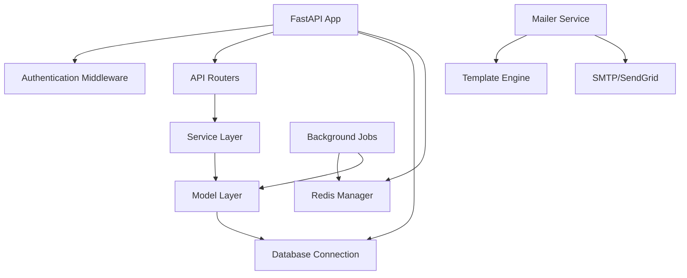

# System Patterns: Serp Template

## Architecture Overview

### Rails-Inspired Structure
```
serp-template/
├── app/          # Application logic (models, APIs, jobs, services)
├── bin/          # Executable scripts (console, task runner)
├── config/       # Configuration files and setup
├── db/           # Database schemas, migrations, seeds
├── lib/          # Shared libraries and core functionality
├── tests/        # Test suite
├── static/       # Static assets
└── tmp/          # Temporary files
```

### Core Design Patterns

#### 1. MVC-Inspired Organization
- **Models**: `app/models/` - Data layer with Tortoise ORM
- **Views**: API endpoints in `app/api/` - JSON responses (no traditional views)
- **Controllers**: FastAPI router functions handle request/response logic
- **Services**: `app/services/` - Business logic abstraction

#### 2. Layered Architecture
```
┌─────────────────────┐
│   API Layer        │ ← FastAPI routers, request handling
├─────────────────────┤
│   Service Layer    │ ← Business logic, orchestration
├─────────────────────┤
│   Model Layer      │ ← Data models, domain logic
├─────────────────────┤
│   Infrastructure   │ ← Database, Redis, external services
└─────────────────────┘
```

#### 3. Configuration Management
- **Environment-based**: Separate configs for dev/test/prod
- **Settings Pattern**: Centralized configuration via `config.core.settings`
- **Service Registration**: Database, Redis, mailer configured at startup

#### 4. Authentication Architecture
- **JWT-based**: Stateless token authentication
- **Multi-provider**: Email, Google, Facebook login support
- **Token Management**: Automatic refresh, secure logout
- **Middleware Integration**: FastAPI security schemes

## Key Technical Decisions

### Database Layer
- **ORM Choice**: Tortoise ORM for async Python
- **Migration System**: Aerich for schema management
- **Connection Pooling**: Built-in async connection management
- **Multi-environment**: Separate DB configs per environment

### Async Architecture
- **ASGI Server**: Uvicorn for high-performance async serving
- **Async ORM**: Tortoise ORM with native async support
- **Background Jobs**: Celery for task processing
- **Real-time**: WebSocket support via FastAPI

### Security Patterns
- **Password Encryption**: bcrypt for secure password hashing
- **JWT Implementation**: PyJWT with proper token validation
- **CORS Handling**: Configurable cross-origin policies
- **Input Validation**: Pydantic schemas for request validation

## Component Relationships

### Core Dependencies


### Module Organization
- **lib/core/**: Framework-level functionality (database, auth, jobs)
- **app/**: Application-specific logic
- **config/**: Environment and service configuration
- **tests/**: Comprehensive test coverage

## Critical Implementation Paths

### Request Processing Flow
1. **Request Arrival**: FastAPI receives HTTP request
2. **Authentication**: JWT middleware validates tokens
3. **Route Matching**: FastAPI routes to appropriate handler
4. **Validation**: Pydantic schemas validate input
5. **Service Call**: Business logic executed in service layer
6. **Data Access**: Models interact with database via Tortoise ORM
7. **Response**: JSON response returned to client

### Background Job Processing
1. **Job Creation**: Celery tasks queued via Redis
2. **Worker Processing**: Celery workers consume jobs
3. **Database Access**: Jobs can interact with models
4. **Error Handling**: Failed jobs retry with exponential backoff
5. **Monitoring**: Flower provides job monitoring interface

### Authentication Flow
1. **Login Request**: User credentials received
2. **Validation**: Password checked, user verified
3. **Token Generation**: JWT created with user claims
4. **Token Storage**: Token optionally stored in database
5. **Request Authorization**: Subsequent requests include JWT
6. **Token Validation**: Middleware verifies token signature

## Scalability Considerations
- **Async Architecture**: Non-blocking I/O for high concurrency
- **Database Connection Pooling**: Efficient resource utilization
- **Background Job Queue**: Offload heavy processing
- **Stateless Design**: JWT enables horizontal scaling
- **Caching Layer**: Redis for performance optimization
